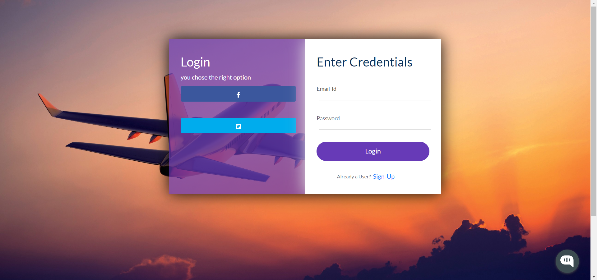
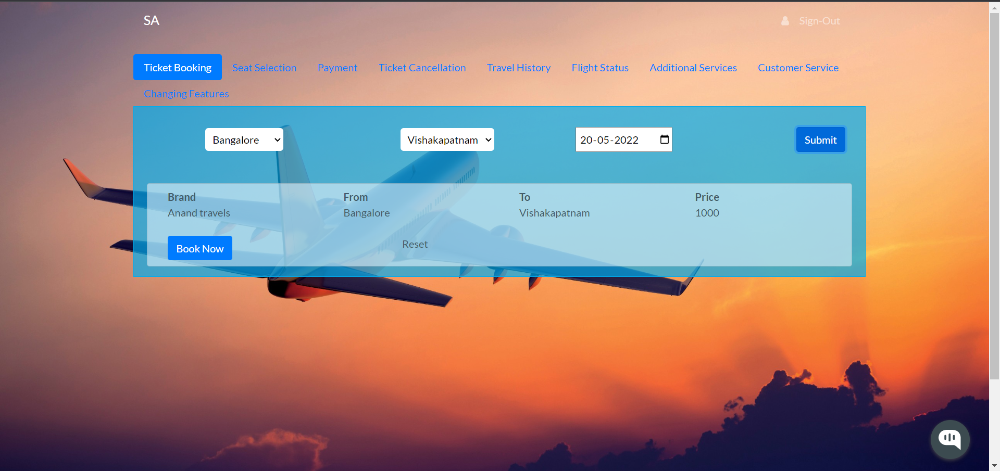
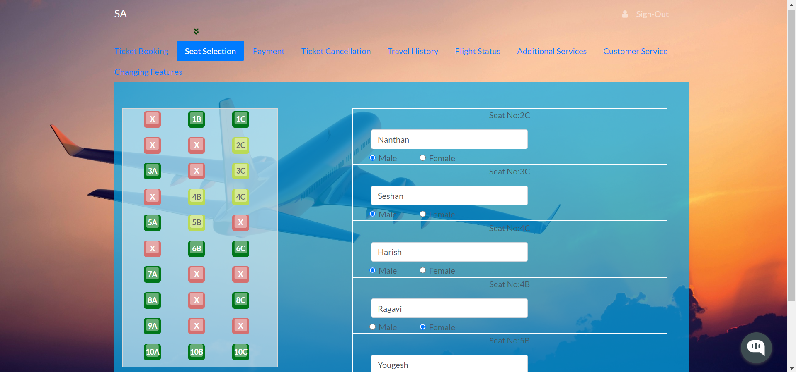
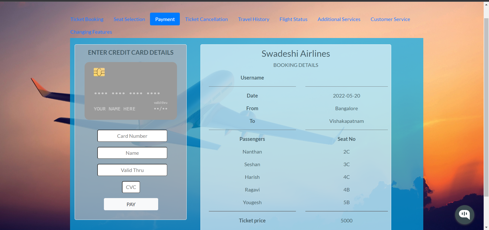
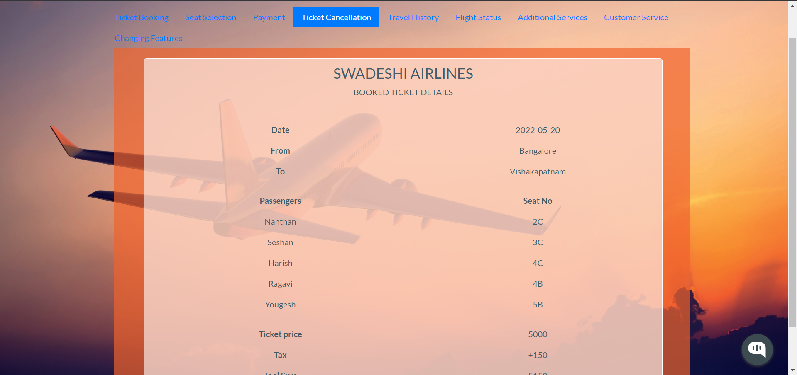
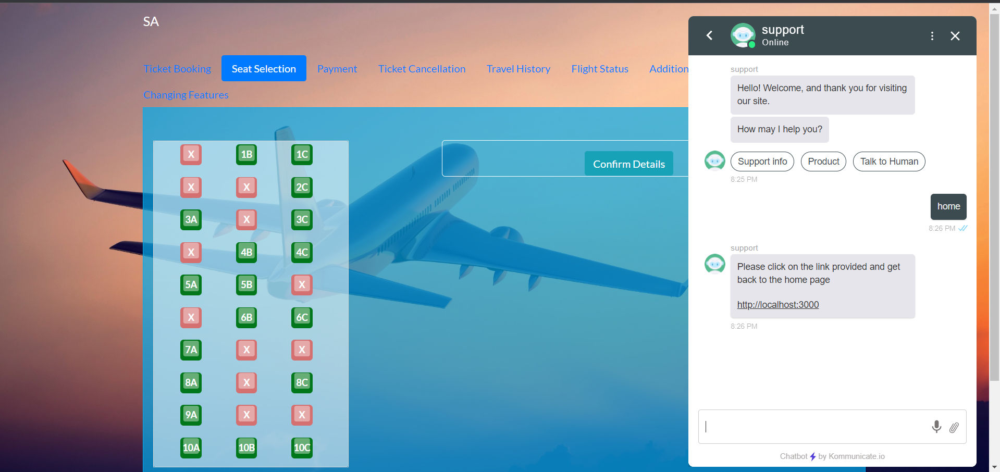

# MERN-Flight-Booking-Application

A complete flight booking application made using MERN Stack (MongoDB, Express js, React js, Node js)

The Flight ticket booking app is composed of the following Features:

### Front-End

* Sign-In & Sign-Up Pages.

* Uses Token based system, so only registered users can access the website  passport js.

* Password hashing using passport js.

* Has a profile page, which will display all information about the signed in user.

* List of cities for users to choose from (starting city & destination city). 

* Getting list of flight's of different airlines with various details.

* Seat selection page has a very user friendly environment, which also generates dynamic forms for storing data's of passengers.

* Has a Confirmation page, which gets a debit card data using react-credit-cards. This version of the application does not include handling the payment process. 

* Final page has a boarding pass displaying component, it displays all passenger data and also generates a random number as a transaction ID.

* Ticket Cancellation page will cancel the ticket which was booked.

* Also has an integrated ai chatbot

### Back-End

* Uses Express js based application for the backend process.

* Uses MongoDB atlas for storing the collections.

* Uses passport js for authenticating user and token based system.

* Uses passport js for hashing the password before sending the data to the cloud.

* This version does not support dynamic seat data being stored from cloud.

This project also demonstrates:

* a typcial React project layout structure

**Screenshots:**
Signing In Page:

Flight Selection Page:

Seat Selection Page:

Payment & Confirmation Page:

Ticket Cancellation Page:

Integrated AI Chatbot:

---

## Developed With

* [Visual Studio Code](https://code.visualstudio.com/) 
* [Node.js](https://nodejs.org/en/)
* [React](https://reactjs.org/)
* [Babel](https://babeljs.io/) 
* [Webpack](https://webpack.js.org/) 
* [SCSS](http://sass-lang.com/)
* [Bootstrap 4](https://getbootstrap.com/)
* [Axios](https://github.com/axios/axios) 
* [Express js](http://expressjs.com/) 
* [MongoDB atlas](https://www.mongodb.com/cloud/atlas) 
* [Passport Js](http://www.passportjs.org/) 

